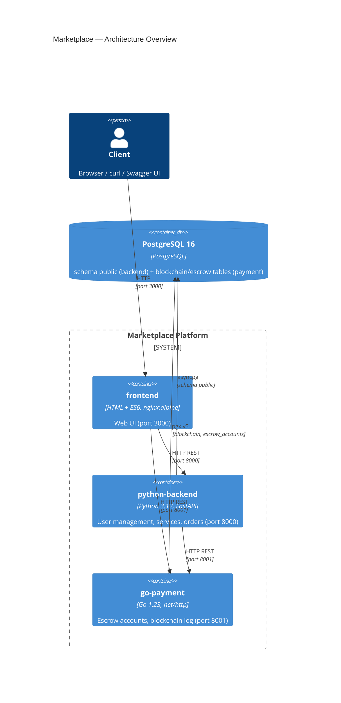

# Архитектурная диаграмма (Mermaid C4)

```mermaid
C4Container
    title Marketplace — Architecture Overview

    Person(client, "Client", "Browser / curl / Swagger UI")

    System_Boundary(marketplace, "Marketplace Platform") {
        Container(frontend, "frontend", "HTML + ES6, nginx:alpine", "Web UI (port 3000)")
        Container(backend, "python-backend", "Python 3.12, FastAPI", "User management, services, orders (port 8000)")
        Container(payment, "go-payment", "Go 1.23, net/http", "Escrow accounts, blockchain log (port 8001)")
    }

    ContainerDb(postgres, "PostgreSQL 16", "PostgreSQL", "schema public (backend) + blockchain/escrow tables (payment)")

    Rel(client, frontend, "HTTP", "port 3000")
    Rel(frontend, backend, "HTTP REST", "port 8000")
    Rel(frontend, payment, "HTTP REST", "port 8001")
    Rel(backend, payment, "HTTP REST", "port 8001")
    Rel(backend, postgres, "asyncpg", "schema public")
    Rel(payment, postgres, "pgx v5", "blockchain, escrow_accounts")
```
