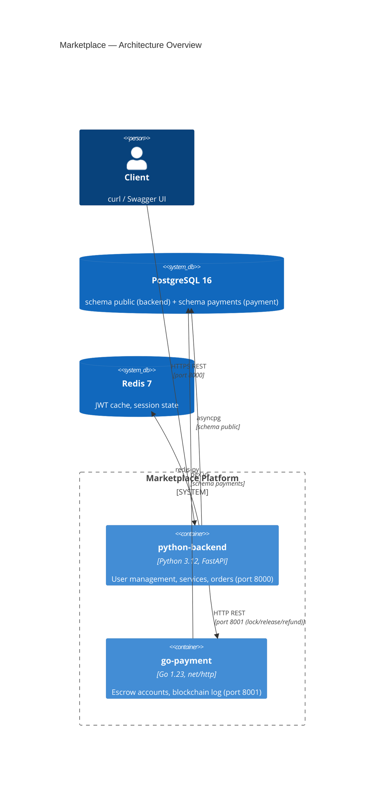

# Архитектурная диаграмма (Mermaid C4)

```mermaid
C4Context
    title Marketplace — Architecture Overview

    Person(client, "Client", "curl / Swagger UI")

    System_Boundary(marketplace, "Marketplace Platform") {
        Container(backend, "python-backend", "Python 3.12, FastAPI", "User management, services, orders (port 8000)")
        Container(payment, "go-payment", "Go 1.23, net/http", "Escrow accounts, blockchain log (port 8001)")
    }

    SystemDb(postgres, "PostgreSQL 16", "schema public (backend) + schema payments (payment)")
    SystemDb(redis, "Redis 7", "JWT cache, session state")

    Rel(client, backend, "HTTPS REST", "port 8000")
    Rel(backend, payment, "HTTP REST", "port 8001 (lock/release/refund)")
    Rel(backend, postgres, "asyncpg", "schema public")
    Rel(backend, redis, "redis-py")
    Rel(payment, postgres, "pgx v5", "schema payments")
```
