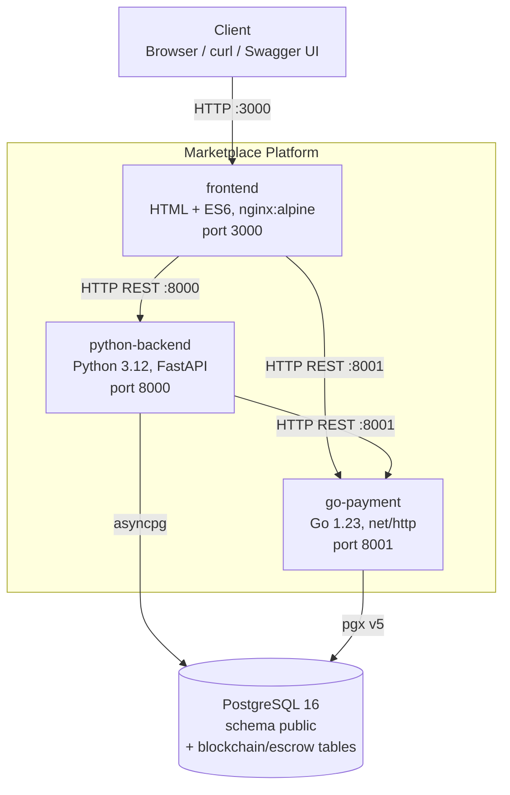

# Архитектурная диаграмма (Mermaid C4)

```mermaid
graph TD
    client["Client\nBrowser / curl / Swagger UI"]

    subgraph marketplace["Marketplace Platform"]
        frontend["frontend\nHTML + ES6, nginx:alpine\nport 3000"]
        backend["python-backend\nPython 3.12, FastAPI\nport 8000"]
        payment["go-payment\nGo 1.23, net/http\nport 8001"]
    end

    postgres[("PostgreSQL 16\nschema public\n+ blockchain/escrow tables")]

    client -->|"HTTP :3000"| frontend
    frontend -->|"HTTP REST :8000"| backend
    frontend -->|"HTTP REST :8001"| payment
    backend -->|"HTTP REST :8001"| payment
    backend -->|"asyncpg"| postgres
    payment -->|"pgx v5"| postgres
```
