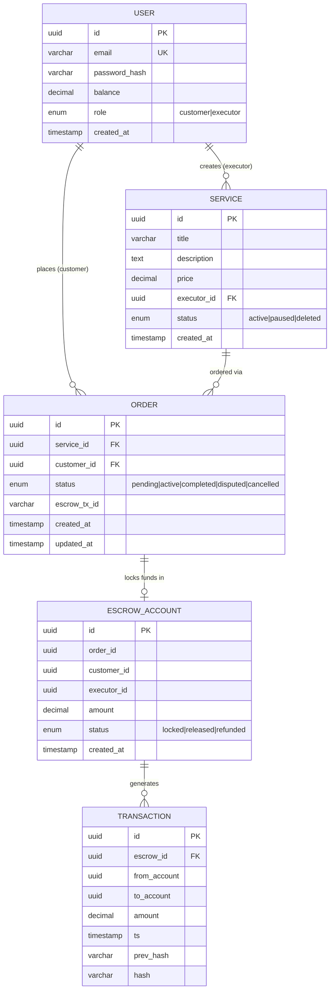

# ER-диаграмма (Mermaid)

```mermaid
erDiagram
    USER {
        uuid id PK
        varchar email UK
        varchar password_hash
        decimal balance
        enum role "customer|executor"
        timestamp created_at
    }

    SERVICE {
        uuid id PK
        varchar title
        text description
        decimal price
        uuid executor_id FK
        enum status "active|paused|deleted"
        timestamp created_at
    }

    ORDER {
        uuid id PK
        uuid service_id FK
        uuid customer_id FK
        enum status "pending|active|completed|disputed|cancelled"
        varchar escrow_tx_id
        timestamp created_at
        timestamp updated_at
    }

    ESCROW_ACCOUNT {
        uuid id PK
        uuid order_id
        uuid customer_id
        uuid executor_id
        decimal amount
        enum status "locked|released|refunded"
        timestamp created_at
    }

    TRANSACTION {
        uuid id PK
        uuid escrow_id FK
        uuid from_account
        uuid to_account
        decimal amount
        timestamp ts
        varchar prev_hash
        varchar hash
    }

    USER ||--o{ SERVICE : "creates (executor)"
    USER ||--o{ ORDER : "places (customer)"
    SERVICE ||--o{ ORDER : "ordered via"
    ORDER ||--o| ESCROW_ACCOUNT : "locks funds in"
    ESCROW_ACCOUNT ||--o{ TRANSACTION : "generates"
```
