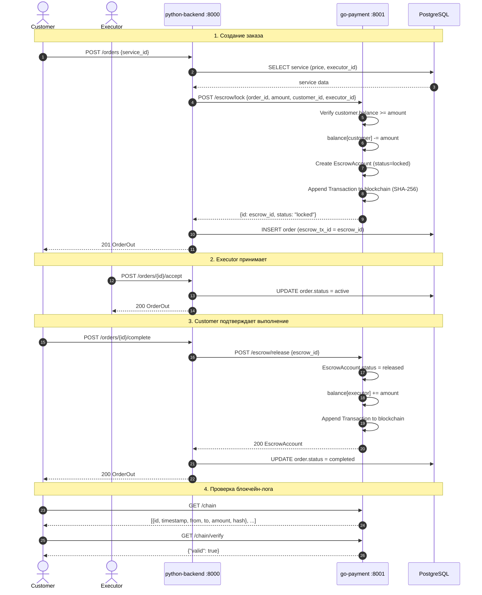

# Sequence Diagram — Полный флоу эскроу-операции (Mermaid)

```mermaid
sequenceDiagram
    autonumber
    actor Customer
    actor Executor
    participant Backend as python-backend :8000
    participant Payment as go-payment :8001
    participant DB as PostgreSQL

    Note over Customer,DB: 1. Создание заказа
    Customer->>Backend: POST /orders {service_id}
    Backend->>DB: SELECT service (price, executor_id)
    DB-->>Backend: service data
    Backend->>Payment: POST /escrow/lock {order_id, amount, customer_id, executor_id}
    Payment->>Payment: Verify customer.balance >= amount
    Payment->>Payment: balance[customer] -= amount
    Payment->>Payment: Create EscrowAccount (status=locked)
    Payment->>Payment: Append Transaction to blockchain (SHA-256)
    Payment-->>Backend: {id: escrow_id, status: "locked"}
    Backend->>DB: INSERT order (escrow_tx_id = escrow_id)
    Backend-->>Customer: 201 OrderOut

    Note over Customer,DB: 2. Executor принимает
    Executor->>Backend: POST /orders/{id}/accept
    Backend->>DB: UPDATE order.status = active
    Backend-->>Executor: 200 OrderOut

    Note over Customer,DB: 3. Customer подтверждает выполнение
    Customer->>Backend: POST /orders/{id}/complete
    Backend->>Payment: POST /escrow/release {escrow_id}
    Payment->>Payment: EscrowAccount.status = released
    Payment->>Payment: balance[executor] += amount
    Payment->>Payment: Append Transaction to blockchain
    Payment-->>Backend: 200 EscrowAccount
    Backend->>DB: UPDATE order.status = completed
    Backend-->>Customer: 200 OrderOut

    Note over Customer,DB: 4. Проверка блокчейн-лога
    Customer->>Payment: GET /chain
    Payment-->>Customer: [{id, timestamp, from, to, amount, hash}, ...]
    Customer->>Payment: GET /chain/verify
    Payment-->>Customer: {"valid": true}
```
